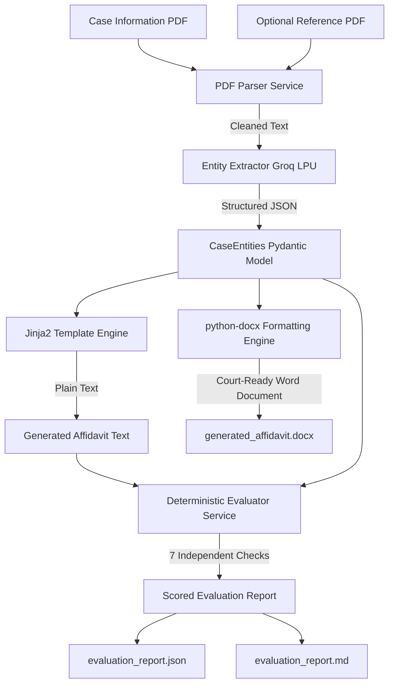

# Legal Document Generation & Evaluation Agent

An AI-powered system designed to generate court-ready **Affidavit in Reply** documents for the High Court of Judicature at Bombay and evaluate them for accuracy, completeness, and structural consistency. The system accepts case information PDFs, extracts structured entities using Groq LLM with strict schema enforcement, generates formatted Word (`.docx`) deliverables following the 10-part court skeleton, and runs 7 deterministic validation checks.

---

## 🏗️ Architecture & Workflow



---

## ✨ Features

- **Robust PDF Parsing**: Uses `pdfplumber` with regex normalization to repair broken OCR artifacts, split words, and irregular line breaks.
- **Structured Intermediate Representation**: Employs Pydantic schemas ([`CaseEntities`](backend/app/models/entities.py)) as the single source of truth between extraction and document generation.
- **Organisation vs. Individual Deponent Branching**: Automatically adapts legal opening phrasing depending on whether the deponent is a private citizen or an officer representing a statutory/corporate respondent (e.g. MMRDA, BMC).
- **Dual Document Output**:
  - **Plain Text** (via Jinja2) for deterministic validation checks and previewing.
  - **Typeset Word Document** (`.docx` via `python-docx`) featuring bold caps headings, justified body text, bold numbered paragraphs, and right-aligned deponent signatures.
- **Deterministic Evaluator**: 7 non-LLM checks (exceeding the 3 required) covering respondent consistency, verification paragraph ranges, verb agreement, section completeness, and entity fidelity across 6 weighted dimensions.
- **RESTful API**: FastAPI backend with health monitoring, dynamic file naming based on the uploaded case file, and streaming file downloads with cache-control headers.

---

## 🚀 Setup & Installation

### Prerequisites
- **Python:** 3.11+ (Tested on Python 3.13)
- **Groq API Key:** Obtain an API key from [Groq Console](https://console.groq.com/)

### 1. Clone the Repository
```bash
git clone https://github.com/Satyamrtiwari/affidavit.git
cd affidavit
```

### 2. Configure Environment
```bash
cd backend
copy .env.example .env
```
Edit `.env` and insert your Groq API key:
```env
GROQ_API_KEY=gsk_your_groq_api_key_here
GROQ_MODEL=openai/gpt-oss-120b
APP_ENV=development
APP_DEBUG=true
```

### 3. Install Dependencies
```bash
pip install -r requirements.txt
```

---

## 💻 How to Run

### Start the FastAPI Dev Server
From the `backend` folder:
```bash
uvicorn app.main:app --reload --port 8000
```
- Interactive Swagger UI Documentation: `http://localhost:8000/docs`
- Health Check: `http://localhost:8000/api/health`

### Run Automated Tests
```bash
pytest -v
```
Runs the full 15-test suite covering the parser, generator, validation failure detection, and API endpoints.

---

## 📋 Evaluation Dimensions & Scoring

| Dimension | Weight | Description |
|---|---|---|
| **Entity Accuracy** | 20% | Verifies court name, party names, case number, year, and dates |
| **Completeness** | 20% | Ensures all 11 required Bombay High Court sections are present |
| **Structure** | 20% | Verifies paragraph numbering, prayer sub-clauses, and jurat ordering |
| **Consistency** | 15% | Ensures respondent number remains identical across all body references |
| **Template Fidelity** | 15% | Validates core fixed legal phrases and deponent-respondent alignment |
| **Hallucination Check** | 10% | Confirms entities strictly derive from the supplied case information |

---

## 📐 Design Decisions

1. **Why Deterministic Evaluation instead of LLM-as-a-judge?**
   - LLMs can suffer from non-deterministic scoring and bias. Legal documents require strict rule adherence (e.g. paragraph ranges and respondent numbers must match exactly). Regex and AST checks guarantee 100% repeatable, explainable audits with zero API latency.
2. **Why Jinja2 + python-docx dual output?**
   - Jinja2 provides clean, readable text strings optimal for fast regex evaluation, while `python-docx` produces court-ready typeset documents with precise typography and margin alignments.
3. **Model Selection (`openai/gpt-oss-120b` on Groq):**
   - A 120-billion parameter model running on Groq LPUs delivers high instruction following and schema accuracy in ~3 seconds with native JSON Mode.

---

## ⚠️ Known Limitations & Failure Cases

- **Scanned Image PDFs**: The system currently parses text-based PDFs via `pdfplumber`. Purely image-based scans require an upstream OCR pipeline (e.g., Tesseract or Google Cloud Vision).
- **Para-Wise Counter-Pleadings**: In accordance with the assignment scope, paragraph-by-paragraph replies to petitions are not supported; the system focuses on structured general affidavits in reply.

---

