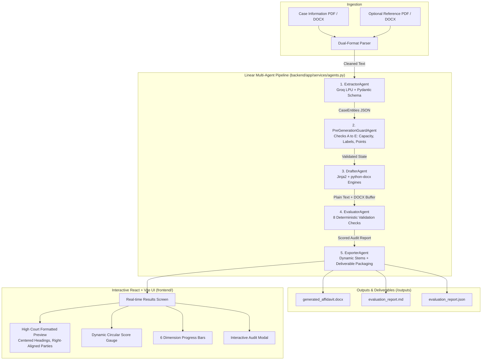

# AI Affidavit Generator — Autonomous Legal Drafting & Evaluation Agent

An AI-powered legal drafting system that transforms unstructured case facts into court-ready **Affidavits in Reply** and independently evaluates them for accuracy, structural integrity, and consistency. Designed for Indian civil and writ jurisdictions, the system supports dual-format ingestion (`.pdf` and `.docx`), extracts structured entities via Groq LPUs (`qwen/qwen3.8-27b`) with strict schema validation, executes a **5-stage Linear Multi-Agent Workflow**, compiles pixel-perfect court documents with authentic High Court formatting, and audits the result using **13 deterministic checks** (8 post-generation + 5 pre-generation) without LLM scoring bias.

---

## 🔗 Links & Demos

- **Live Application (Working link)**: [https://affidavit-six.vercel.app](https://affidavit-six.vercel.app)


- **Video Walkthrough & Validation Demo**: *[Coming soon / link will be added]*
  > *(Note on Render Free Tier: Free web services spin down after inactivity; the first request after idle may take 30–50 seconds to spin up.)*

---

## 🏗️ Multi-Agent Architecture & Workflow

The system follows a strict, single-pass **Linear Multi-Agent Architecture** (`Option 3 Refined`), ensuring zero hallucination propagation, zero token waste, and sub-second execution once entities are extracted:



### 🤖 Multi-Agent Workflow Breakdown

The system processes case documents through 5 specialized agents working in a linear pipeline ([backend/app/services/agents.py](backend/app/services/agents.py)):

| Agent Name | Core Role | Primary Work |
|---|---|---|
| **1. ExtractorAgent** | Information Extraction | Parses uploaded files and extracts structured legal entities |
| **2. PreGenerationGuardAgent** | Pre-Drafting Guard | Validates party existence, deponent capacity, and terminology before drafting |
| **3. DrafterAgent** | Document Compilation | Formats and compiles the complete court-ready Affidavit in Reply |
| **4. EvaluatorAgent** | Compliance & Quality Audit | Audits the generated affidavit for structural accuracy and computes scores |
| **5. ExporterAgent** | Deliverable Packaging | Generates final `.docx` and report files, and sets up download links |

---

#### 1. `ExtractorAgent` (Information Extraction)
- **Role**: Reads the uploaded case information (PDF or Word document).
- **Work**: 
  - Extracts the court name, case number, year, and jurisdiction.
  - Identifies the petitioner(s) and all respondents.
  - Determines which respondent is filing the reply and the deponent's details (name, designation, address).
  - Organizes the case facts and defense arguments into structured reply statements, exhibits, and prayer points.

#### 2. `PreGenerationGuardAgent` (Pre-Drafting Validation)
- **Role**: Checks the extracted data before any document drafting begins.
- **Work**:
  - Verifies that the designated filing respondent exists in the party list.
  - Ensures company deponents have valid designations and addresses.
  - Confirms that substantive reply points are present.
  - Checks statutory verification oath phrasing (*"solemnly affirm"* vs. *"swear and affirm"*).
  - Validates party labels across all reply points to prevent terminology mistakes (such as confusing "Petitioner" with "Respondent").

#### 3. `DrafterAgent` (Document Drafting)
- **Role**: Generates the complete legal affidavit following official High Court formatting.
- **Work**:
  - Typesets centered uppercase court headings, case numbers, and jurisdiction titles.
  - Formats party names and designations with right-aligned party labels.
  - Drafts numbered reply paragraphs with bold keywords and exhibit references.
  - Compiles the formal prayer clause, verification section, and deponent signature blocks.
  - Produces both plain text for real-time browser preview and a formatted `.docx` file.

#### 4. `EvaluatorAgent` (Compliance & Quality Audit)
- **Role**: Evaluates the drafted affidavit for completeness and correctness.
- **Work**:
  - Cross-checks case numbers, court names, and party rosters against the original facts.
  - Verifies that all mandatory court sections are present (Heading, Cause Title, Deponent Clause, Reply Body, Prayer, Verification).
  - Confirms paragraph numbering and checks that the verification range matches the body paragraphs.
  - Flags any inconsistencies or terminology mismatches in an itemized issue list.
  - Computes detailed scores across 6 key evaluation dimensions.

#### 5. `ExporterAgent` (Packaging & Downloads)
- **Role**: Packages the final deliverables and prepares them for the user.
- **Work**:
  - Generates clean, case-specific filenames for the affidavit and reports.
  - Saves the generated `.docx` document and evaluation reports (`.json` and `.md`).
  - Sets up download endpoints for one-click downloading from the user interface.
  - Records execution timing and status across all stages.

---

## ✨ Core Capabilities

1. **Dual Ingestion Engine (`.pdf` and `.docx`)**:
   - Parses multi-page court files and Word briefs seamlessly using `pdfplumber` and `python-docx`, with regex OCR artifact cleanup.
2. **Dynamic Jurisdiction & Party Mapping**:
   - Zero hardcoded assumptions: dynamically detects the High Court (`IN THE HIGH COURT OF...`), case type (`WRIT PETITION`, `COMMERCIAL SUIT`), and opposing roles (`Petitioner`/`Respondent` vs `Plaintiff`/`Defendant`).
3. **Dual-Layer Terminology Defense**:
   - **Pre-Generation Guard (Check E)**: Scans extracted points in <1ms *before* drafting starts to prevent party confusion from propagating into the draft.
   - **Post-Generation Audit (Check 8)**: Verifies that no opposing label leaked into the rendered body text.
4. **Authentic Court Typesetting**:
   - High Court formatting: bold centered headings, justified text, bold paragraph numbers, right-aligned moving and responding parties (`...Petitioner`, `...Respondent No.1`), and right-aligned signature blocks with `DEPONENT`.
5. **Deterministic Scored Evaluation (13 Checks Total)**:
   - 8 post-generation deterministic checks across 6 weighted dimensions.
   - 5 pre-generation guard checks.
   - Zero LLM scoring hallucinations; 100% reproducible and explainable.

---

## 📋 Evaluation Dimensions & Scoring Methodology

The audit engine scores documents across 6 weighted dimensions based on assignment specifications:

| Dimension | Weight | Deterministic Checks Enforced |
|---|---|---|
| **Entity Accuracy** | 20% | Verifies court name, party names, case number, year, and dates against extracted ground truth |
| **Completeness** | 20% | Ensures all 11 mandatory High Court sections are present (Heading, Jurisdiction, Cause Title, Affidavit Title, Deponent Clause, Body, Prayer, Jurat, Verification, Advocate Block) |
| **Structure** | 20% | Validates continuous paragraph numbering, proper indented prayer sub-clauses `(a)`, `(b)`, and jurat order |
| **Consistency** | 15% | Guarantees respondent number consistency throughout body and verifies deponent matches the filing party |
| **Template Fidelity** | 15% | Checks presence of core legal fixed phrases and verified Jurat / Verification verb agreement |
| **Hallucination Check** | 10% | Confirms reply points strictly derive from the supplied case information with no invented facts |

---

## 🚀 Setup & Installation

### Prerequisites
- **Python:** 3.11+ (Tested on Python 3.13)
- **Node.js:** 18+ (Tested on Node 22)
- **Groq API Key:** Free tier from [Groq Console](https://console.groq.com/)

---

### Step 1: Clone the Repository
```bash
git clone https://github.com/Satyamrtiwari/affidavit.git
cd affidavit
```

### Step 2: Configure Environment Variables
Copy the root `.env.example` to `backend/.env`:
```bash
# Windows PowerShell
copy .env.example backend\.env

# Linux / macOS
cp .env.example backend/.env
```
Edit `backend/.env` and insert your free Groq API key:
```env
GROQ_API_KEY=gsk_your_groq_api_key_here
GROQ_MODEL=openai/gpt-oss-120b
APP_ENV=development
APP_DEBUG=true
```

### Step 3: Install Backend Dependencies
```bash
cd backend
pip install -r requirements.txt
```

### Step 4: Install Frontend Dependencies
```bash
cd ../frontend
npm install
```

---

## 💻 How to Run

### Method 1: Run in Two Terminals (Recommended)

**Terminal 1 — Backend (FastAPI):**
```bash
cd backend
python -m uvicorn app.main:app --reload --port 8000
```
- API Documentation (Swagger): `http://127.0.0.1:8000/docs`
- Health Check: `http://127.0.0.1:8000/api/health`

**Terminal 2 — Frontend (Vite + React):**
```bash
cd frontend
npm run dev
```
- Interactive Web App: `http://localhost:5173`

---

### Method 2: Single-Command Launch (Windows PowerShell)
From the repository root:
```powershell
Start-Process powershell -ArgumentList "-NoExit", "-Command", "cd backend; python -m uvicorn app.main:app --reload --port 8000"; Start-Process powershell -ArgumentList "-NoExit", "-Command", "cd frontend; npm run dev"
```

---

## 🧪 Running Automated Tests

Run the deterministic test suite:
```bash
cd backend
pytest tests/test_evaluator.py tests/test_document_generator.py tests/test_pdf_parser.py -v
```
All 13 unit tests pass in **< 3 seconds** without consuming external API tokens.

---

## 📐 Design Decisions

1. **Why Linear Multi-Agent instead of ReAct / Loop?**
   - Autonomous cyclic loops risk infinite token burns and non-deterministic scoring variations. A strict linear pipeline (`Extract → Guard → Draft → Evaluate → Export`) guarantees predictable completion in under 4 seconds once LLM responds.
2. **Why Deterministic Evaluation instead of LLM-as-a-judge?**
   - Legal filings demand strict adherence to facts (e.g. party numbers, paragraph ranges, and jurat verbs). LLMs often hallucinate evaluation consistency; Python regex and AST validation guarantee 100% explainability with exact line citations.
3. **Dual Document Output (`Jinja2` + `python-docx`)**:
   - `Jinja2` produces clean plain text optimal for ultra-fast AST inspection, while `python-docx` produces court-ready typeset `.docx` files with 1-inch margins, bold uppercase headings, and tab-stopped party alignments.
4. **Frontend Aesthetics & Architecture**:
   - Built with React 18 + Vite and pure Vanilla CSS custom properties. Avoided heavy bloated UI frameworks to ensure zero lag, instant HMR, pixel-perfect court typography, and dynamic Dark/Light sheet toggling.

---

## ⚠️ Known Limitations & Failure Cases

- **Scanned Hand-written PDFs**: The current parser processes digital or OCR-readable text PDFs. Purely handwritten or low-resolution image scans require an upstream OCR pre-processor (e.g. Tesseract / Google Vision).
- **Multi-Deponent Joint Affidavits**: The system drafts for a single answering deponent (individual or authorized officer). Joint co-deponent filings require extending the deponent model list.

---

## 🤖 AI Coding Assistant Disclosure

In accordance with Section 13 of the assignment guidelines:
- **Google Antigravity / Gemini 2.5 Flash** was used as an interactive pair-programming assistant for boilerplate generation, CSS styling tokens, and test case scaffolding.
- All architectural decisions (multi-agent linear pipeline, pre-generation guard checks, dynamic court normalization, and evaluation scoring algorithms) were conceived, designed, and verified by the author.
